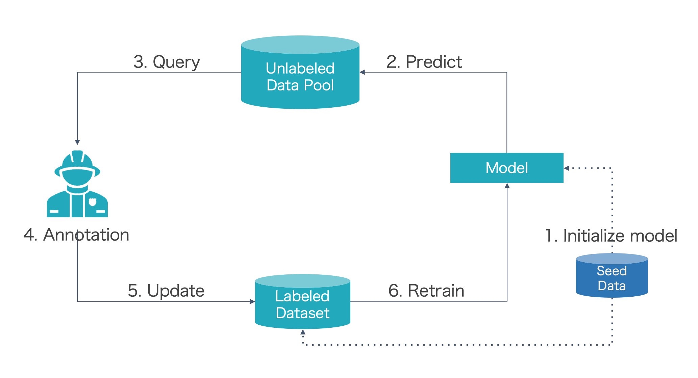

# SegAL

<p align="center">
  <a href="https://github.com/BrambleXu/segal/actions?query=workflow%3ACI">
    
  </a>
  <a href="https://python-poetry.org/">
    
  </a>
  <a href="https://github.com/ambv/black">
    
  </a>
  <a href="https://github.com/pre-commit/pre-commit">
    
  </a>
</p>
<p align="center">
  <a href="https://pypi.org/project/segal/">
    
  </a>
  
  
</p>

SegAL is an active learning freamwork for semantice segmentation.

## Installation

SegAL is available on PyPI:

`pip install segal`

SegAL officially supports Python 3.8.

## Active Learning Cycle

To understand what SegAL can do, we first introduce the pool-based active learning cycle.



- Step 0: Prepare seed data (a small number of labeled data used for training)
- Step 1: Train the model with seed data
  - Step 2: Predict unlabeled data with the trained model
  - Step 3: Query informative samples based on predictions
  - Step 4: Annotator (Oracle) annotate the selected samples
  - Step 5: Input the new labeled samples to labeled dataset
  - Step 6: Retrain model
- Repeat step2~step6 until the f1 score of the model beyond the threshold or annotation budget is no left

SegAL can simulate the whole active learning cycle.

## Usage

The user can execute the below command to run the active learning cycle.

```
python examples/run_al_cycle.py --dataset CamVid  --data_path ./data/CamVid/ --model_name Unet --encoder resnet34 --encoder_weights imagenet --num_classes 12 --strategy LeastConfidence --seed_ratio 0.02 --query_ratio 0.02 --n_epoch 1
```

- `dataset`: which dataset to use
- `data_path`: the path where the data store
- `model_name`: name of segmentation model. More model names can be found in [architectures](https://github.com/qubvel/segmentation_models.pytorch#architectures-)
- `encoder`: name of encoder used in model. More encoder names can be found in [encoders](https://github.com/qubvel/segmentation_models.pytorch#encoders-)
- `encoder_weights`: pretrained weights. See [encoder table](https://github.com/qubvel/segmentation_models.pytorch#encoders-) with available weights for each encoder
- `num_classes`: number of classes
- `strategy`: name of sampling strategy. Available strategies: `RandomSampling`, `LeastConfidence`, `MarginSampling`, `EntropySampling`. You can find the papers for these strategy in [here](https://github.com/cure-lab/deep-active-learning/tree/main#deep-active-learning-strategies)
- `seed_ratio`: percentage of seed data. The  used for initial training. 
- `query_ratio`: percentage of queried data in each round
- `n_epoch`: number of epoch in each round

More explanation can be found in [usage](./docs/usage.md)
